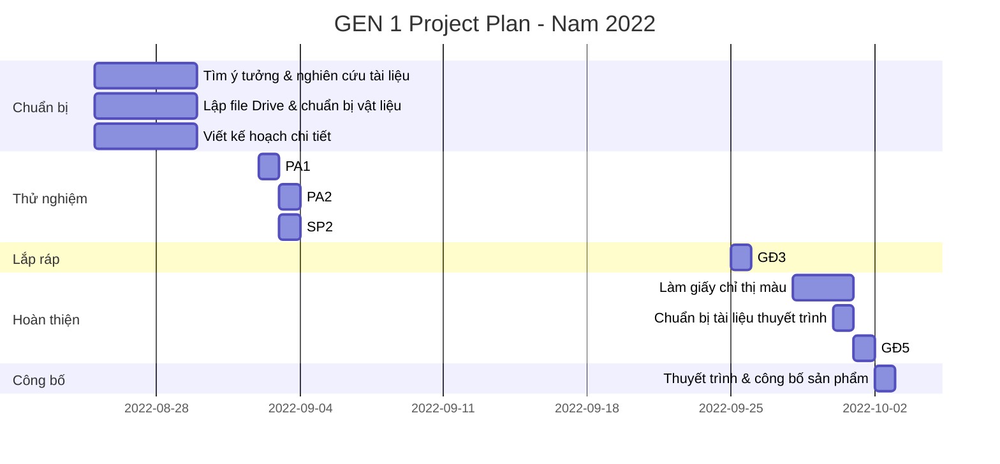
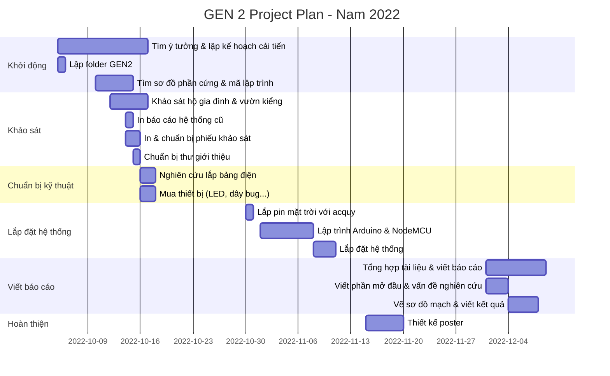

```mermaid
gantt
    title GEN 1 Project Plan - Nam 2022
    dateFormat  YYYY-MM-DD

    section Chuẩn bị
    Tìm ý tưởng & nghiên cứu tài liệu     :2022-08-25, 5d
    Lập file Drive & chuẩn bị vật liệu    :2022-08-25, 5d
    Viết kế hoạch chi tiết                :2022-08-25, 5d

    section Thử nghiệm
    PA1: Thử nghiệm trợ lực               :2022-09-02, 1d
    PA2: Thử nghiệm máy bơm               :2022-09-03, 1d
    SP2: Giấy chỉ thị màu từ nguyên liệu  :2022-09-03, 1d

    section Lắp ráp
    GĐ3: Lắp cảm biến                     :2022-09-25, 1d

    section Hoàn thiện
    Làm giấy chỉ thị màu                  :2022-09-28, 3d
    Chuẩn bị tài liệu thuyết trình       :2022-09-30, 1d
    GĐ5: Làm poster                       :2022-10-01, 1d

    section Công bố
    Thuyết trình & công bố sản phẩm       :2022-10-02, 1d
```

```mermaid
gantt
    title GEN 2 Project Plan - Nam 2022
    dateFormat  YYYY-MM-DD

    section Khởi động
    Tìm ý tưởng & lập kế hoạch cải tiến     :2022-10-05, 12d
    Lập folder GEN2                         :2022-10-05, 1d
    Tìm sơ đồ phần cứng & mã lập trình      :2022-10-10, 5d

    section Khảo sát
    Khảo sát hộ gia đình & vườn kiểng      :2022-10-12, 5d
    In báo cáo hệ thống cũ                  :2022-10-14, 1d
    In & chuẩn bị phiếu khảo sát           :2022-10-14, 2d
    Chuẩn bị thư giới thiệu                 :2022-10-15, 1d

    section Chuẩn bị kỹ thuật
    Nghiên cứu lắp bảng điện               :2022-10-16, 2d
    Mua thiết bị (LED, dây bug...)          :2022-10-16, 2d

    section Lắp đặt hệ thống
    Lắp pin mặt trời với acquy              :2022-10-30, 1d
    Lập trình Arduino & NodeMCU             :2022-11-01, 7d
    Lắp đặt hệ thống                        :2022-11-08, 3d

    section Viết báo cáo
    Tổng hợp tài liệu & viết báo cáo        :2022-12-01, 8d
    Viết phần mở đầu & vấn đề nghiên cứu    :2022-12-01, 3d
    Vẽ sơ đồ mạch & viết kết quả            :2022-12-04, 4d

    section Hoàn thiện
    Thiết kế poster                         :2022-11-15, 5d
```
